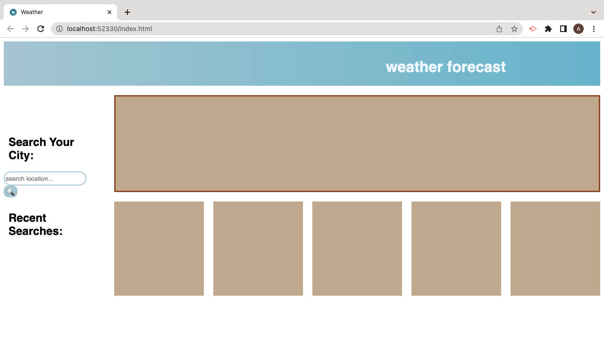

# week-6-weather-api

Customer asked for a page that allows them to search up a location and receive data about weather for the next five days
## User Story

- As a developer I want a page that is interactive using Java Script to allow users to search up a location and retrieve weather data

- So that the user is able to see the weather forecast for the next 5 days

## Acceptance Criteria

- GIVEN page that is interactive with the user to be able to retrieve weather data on a desired location

- WHEN JS elements are understood across search engines to allow for interaction 

- WHEN a user presses onto the search button they can see a range of weather data

- WHEN a user is able to see previous searches for weather data

- WHEN a user reloads the page, they are able to see weather searches from before

- WHEN page allows for smooth navigation from the user

- WHEN page When JS, CSS and HMTL link up accordingly with the page

 
 

My main issue was stopping the local storage doubling each time a search was made. As each tima a location was serched in local storage it duplicated each previous search from the search before creating a long list of the same searches.

 

## General info
This is a page developed through HTML and later styled through CSS. The main functionality of the page comes from Java Script which allows for the interactivity by the user to be able to go into the page and search a location. The user is presented with a page containing a daily show of the weather and the weather across five other days. The user can actively track the weather in their desired city while seeing recent searches listed below

## Page link
https://adibasjd.github.io/week-6-weather-api/

## MY WEB PAGE
Search page presented to the user

User is able to search a location and retrieve back data based on the city searched

User is also able to reload the page and the cities from previous searches still renders on the page

